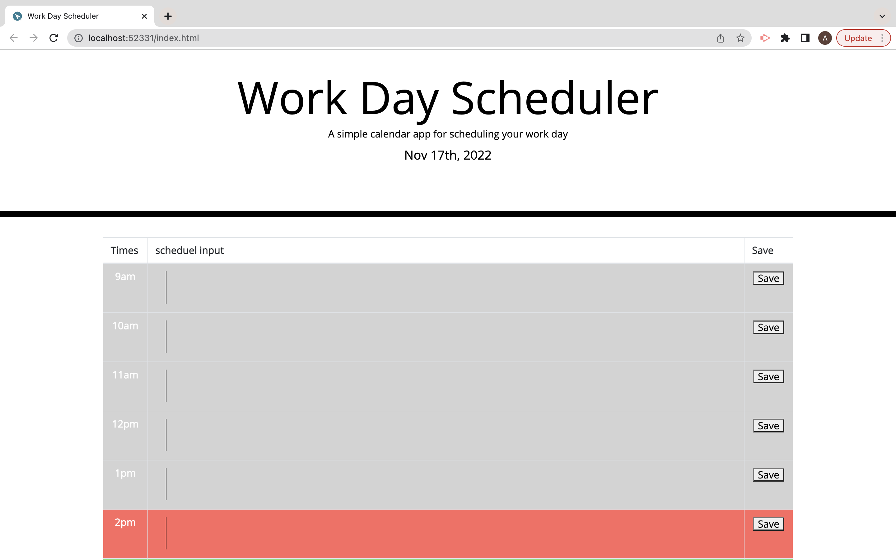
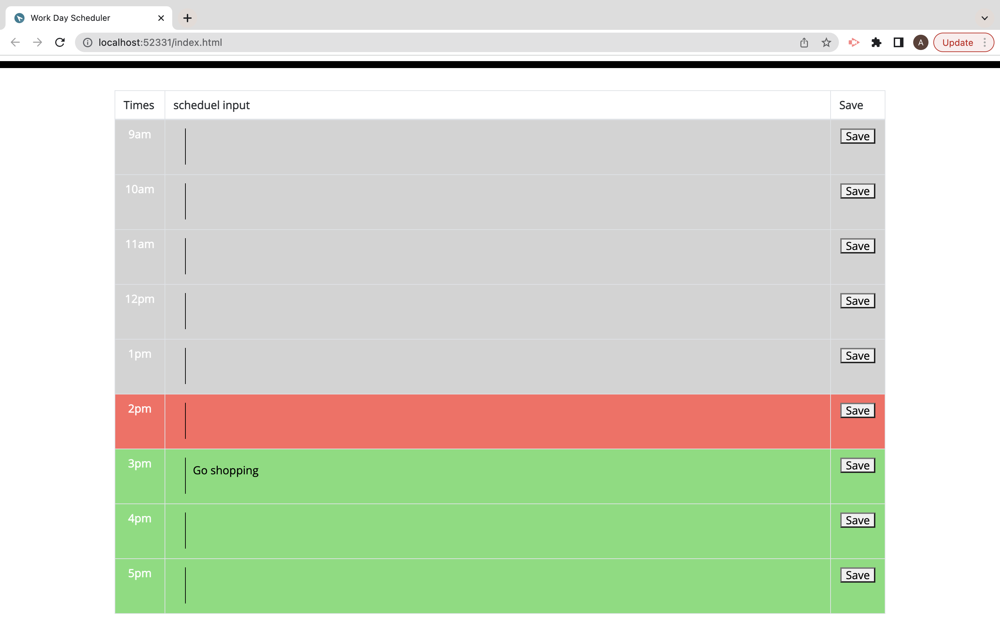

# week-5-planner

Customer asked for a page that allows them to save task to a scheduele that shows tasks to come that have past and current tasks.
## User Story

- As a developer I want a page that is interactive using Java Script to allow users to interact with the web page and input to do tasks into the page that can be saved

- So that the user is able to track there day using the planner

## Acceptance Criteria

- GIVEN page that is interactive with the user to be able to save tasks to times and input and deducted old ones

- WHEN JS elements are understood across search engines to allow for interaction 

- WHEN a user presses onto the save button and is able to save task to the daily planner 

- WHEN a user is able to see past tasks, present tasks and task to come in differnt colors

- WHEN a user reloads the page they are able to see old tasks and new tasks 

- WHEN page allows for smooth navigation from the user

- WHEN a user is able to see the current day they are on

- WHEN page When JS, CSS and HMTL link up accordingly with the page

 
 

My main issue was ensuring my page was able to show the colors for the current time it was on to be able to present the user with the past present and future colors linked to the time of day so a user can keep track of their tasks

 

## General info
This is a page developed through HTML and later styled through CSS. The main functionality of the page comes from Java Script which allows for the interactivity by the user to be able to go into the page and save tasks onto the daily planner. The user is presented with a page containing a daily planner which presents three different colors, red for present, green for the future and grey for the past time. The user is able to actively keep track of their page by going back and furth to add and remove tasks that will be saved to the page so the user can reload the page for them still to be there.
## Page link
https://adibasjd.github.io/week-5-planner/

## MY WEB PAGE
Quiz opening page presented to user.

User is able to see past(grey), future (green) and present (red) on the page.
User is also able to save tasks to the page.

